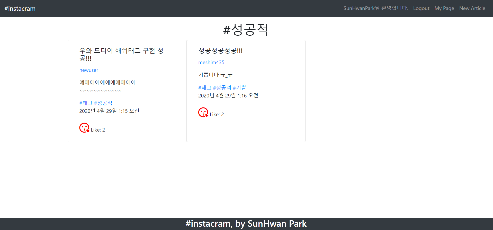
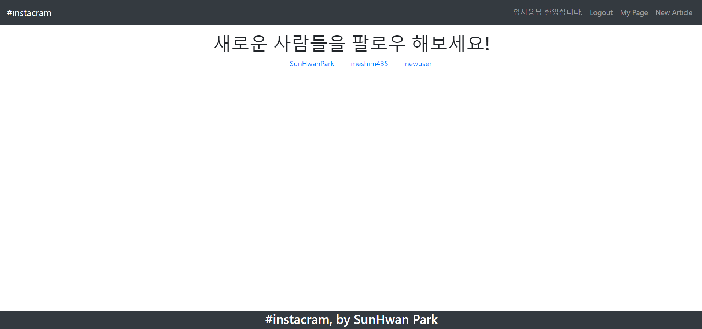
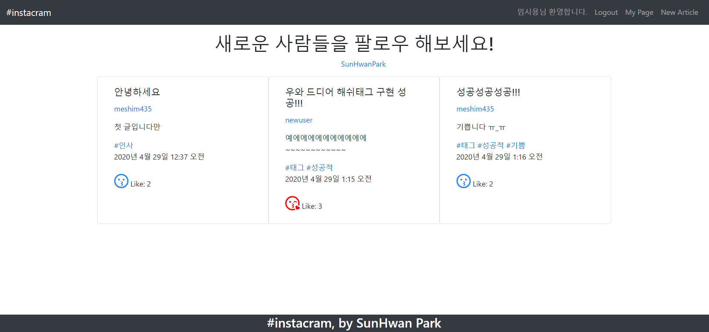

# instagram clone_django

> 기존 게시판 구현에서, [회원가입, 로그인/로그아웃, 글생성, 팔로우, 좋아요, 유저 프로필] 이외에 새로운 기능을 구현해보는 연습

- [새로운 기능 구현](#새로운_기능_구현)
- [어려웠던 점](#어려웠던_점)

## 새로운\_기능_구현

### hashtag 검색 기능 구현



- [django-taggit](https://django-taggit.readthedocs.io/en/latest/index.html) 라이브러리를 활용

1. 환경설정

   ```bash
   $ pip install django-taggit
   ```

   ```python
   # settings.py
   ...
   INSTALLED_APPS = [
   	...
       'taggit',
   ]

   # 만약 태그의 대소문자를 구별하고 싶지 않을 경우 다음과 같이 설정해준다.
   TAGGIT_CASE_INSENSITIVE = True
   ```

2. model에 태그 필드 생성

   ```python
   # models.py

   from django.db import models
   from django.conf import settings
   from taggit.managers import TaggableManager # import

   class Article(models.Model):
       title = models.CharField(max_length=100)
       content = models.TextField()
       created_at = models.DateTimeField(auto_now_add=True)
       updated_at = models.DateTimeField(auto_now=True)
       user = models.ForeignKey(settings.AUTH_USER_MODEL, on_delete=models.CASCADE)
       like_users = models.ManyToManyField(settings.AUTH_USER_MODEL, related_name='like_articles')
       tags = TaggableManager() # tags field 생성
   ```

3. form 관련 설정 - `form.save_m2m()`

   ```python
   # views.py

   @login_required
   def create(request):
       if request.method == 'POST':
           form = ArticleForm(request.POST)
           if form.is_valid():
               article = form.save(commit=False)
               article.user = request.user
               article.save()
               form.save_m2m() # 이 부분을 해주어야 글 작성시 태그 정보가 함께 저장된다.
               return redirect('profile', request.user.username)
       else:
           form = ArticleForm()
       context = {
           'form': form,
       }
       return render(request, 'articles/form.html', context)
   ```

4. url 설정

   ```python
   # urls.py

   from django.urls import path
   from . import views

   app_name = 'articles'

   urlpatterns = [
       ...
       ### hashtag 검색 요청 url 주소
       path('<str:tag_name>/', views.tag_search, name='tag_search'),
   ]
   ```

5. view 설정

   ```python
   # views.py

   @login_required
   def tag_search(request, tag_name):
       # 전체 글 중에서 해당 태그를 가지고 있는 글을 중복없이 뽑아냄
       tag_articles = Article.objects.filter(tags__name__in=[tag_name]).distinct()

       context = {
           'tag_articles':tag_articles,
           'tag_name':tag_name,
       }
       return render(request, 'articles/tag_articles.html', context)
   ```

6. template 설정

   ```html
   <!-- index.html -->

   

   
   <div class="container">
       <div class="row">
   		...
           
           <div class="card col-4" style="width: 18rem;">
             <div class="card-body">
   			...
               <!-- 해당 글의 전체 태그를 하나씩 순회하며 출력 -->
               
               <!-- 해당 태그를 클릭하면 태그 검색 page로 -->
               <a href="" class="card-text d-inline">#{{ tag }} </a>
               
               ...
           </div>
           
       </div>
   </div>
   
   ```

   ```html
   <!-- tag_articles.html -->
   

   
   <div class="container">
       <div class="row">
           <div class="col-12 d-flex flex-column align-items-center">
             <!-- 해당 태그 이름을 Title로 -->
             <h1 class="text-center">#{{ tag_name }}</h1>
           </div>
           <hr>
           <!-- 해당 태그를 지닌 글들을 순회하며 정보 출력 -->
           
           <div class="card col-4" style="width: 18rem;">
             <div class="card-body">
               <h5 class="card-title">{{ article.title }}</h5>
               <p class="card-text"><a href="">{{ article.user.username }}</a></p>
               <p class="card-text">{{ article.content }}</p>
               
               <a href="" class="card-text d-inline">#{{ tag }} </a>
               
               <p class="card-text">{{ article.created_at }}</p>
               
               <a href="" style="font-size: 2em; color: red;"><i class="far fa-kiss-wink-heart"></i></a>
               
               <a href="" style="font-size: 2em; color: Dodgerblue;"><i class="far fa-kiss"></i></a>
               
               Like: {{ article.like_users.count }}
             </div>
           </div>
           
       </div>
   </div>
   
   ```


### [피드] 팔로우 추천 + 팔로우 한 사람의 글만 볼 수 있는 피드





- index(root) page에 자신이 **팔로잉하고 있지 않은 다른 유저**를 **랜덤하게** or **서로 많은 친구(내가 팔로잉하고 있는 유저)를 공유할 수록** 추천해주는 기능

  - 최대 5명까지 추천

- 피드에서 사용자가 **팔로우 한 유저들의 글만 노출!**

  ```python
  # views.py

  from django.shortcuts import render, redirect, get_object_or_404
  from .models import Article
  from .forms import ArticleForm
  from django.contrib.auth.decorators import login_required
  from django.contrib.auth import get_user_model
  import random
  User = get_user_model()

  @login_required
  def index(request):
      users = User.objects.all() # 전체 유저 그룹
      followings = request.user.followings.all() # 사용자가 팔로잉하고 있는 유저 그룹
      unfollowings = users.difference(followings) # 사용자가 팔로잉하고 있지 않은 유저 그룹
      if len(unfollowings) >= 5: # 만약 그 수가 5 이상이라면 랜덤하게 5명만 뽑아 추천
          # 1. 랜덤하게 5명만 뽑아 추천.
          # queryset은 random.shufle()이 먹히지 않는다. 따라서 아래와 같이 구현해야한다.
          # unfollowings = sorted(unfollowings, key=lambda x: random.random())[:5]

          # 2. 서로 많은 친구(내가 팔로잉하고 있는 유저)를 공유하고 있는 사람 5명 뽑아 추천
          unfollowings = sorted(unfollowings, reverse=True, key=lambda x: x.followings.all().intersection(request.user.followings.all()).count())[:5]

      articles = [] # 넘겨줄 글 목록
      for following in followings: # 팔로잉 하고 있는 유저
          for article in following.article_set.all(): # 해당 유저가 쓴 글
              articles.append(article)
      # 해당 글들 생성시간 순으로 정렬
      articles = sorted(articles, key=lambda article: article.created_at)

      context = {
          'unfollowings': unfollowings,
          'articles': articles,
      }
      return render(request, 'articles/index.html', context)
  ```

  ```html
  <!-- index.html -->
  

  
  <div class="container">
      <div class="row">
          <div class="col-12 d-flex flex-column align-items-center">
            <h1 class="text-center">새로운 사람들을 팔로우 해보세요!</h1>
            <ul>
            <!-- 팔로잉 하고 있지 않은 유저들 중에 -->
            
  	        <!-- 자기 자신이 아니라면 노출-->
              
                <li class="m-3 d-inline"><a href="">{{ user.username }}</a></li>
              
            
            </ul>
          </div>
     		...(생략)
  ```


## 어려웠던_점

- 실제 인스타그램 처럼 글 본문에서 바로 태그가 걸리게 만들고 싶었지만, 아직은 실력이 부족쓰.. [초보몽키의 인스타그램 해쉬태그 구현](https://wayhome25.github.io/django/2017/06/22/custom-template-filter/)을 참고해 추후에 다시 도전해보는 걸로.

- queryset은 어떤 때는 set 처럼, 또 어떤 때는 list 처럼 연산이 가능하다.  헷갈리지 않을 수 있게 더 자주 다양한 방식으로 다뤄보자.

  - union, intersection, difference
  - indexing, slicing, sort

- index(root) page와 각 유저의 profile page 모두에서 특정 글에 like를 남길 수 있게 구현하다보니, like 함수의 redirect url 주소를 분기해야하는 문제가 발생했다. 가능한 하나의 함수 안에서 상황에 따라 코드를 분기해 구현하고 싶었으나... 원하던 모습으로 구현이 되지 않아 여러 시도 끝에 두 개의 함수를 만드는 걸로...
  반복되는 코드를 사용했다는 것이 매우 거슬린다. 공부 더 해서 해결하는 걸로.

  - 요청 이전 페이지로 다시 redirect 하는 방법은 없나요..ㅠ_ㅠ

  ```python
  @login_required
  def like_root(request, article_pk):
      article = get_object_or_404(Article, pk=article_pk)
      user = request.user
      if request.user in article.like_users.all():
          article.like_users.remove(user)
      else:
          article.like_users.add(user)
      return redirect('root')

  @login_required
  def like_profile(request, article_pk):
      article = get_object_or_404(Article, pk=article_pk)
      user = request.user
      if request.user in article.like_users.all():
          article.like_users.remove(user)
      else:
          article.like_users.add(user)
      return redirect('profile', article.user.username)
  ```